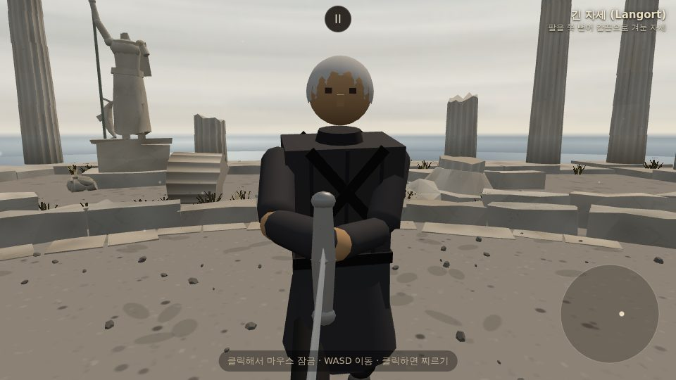
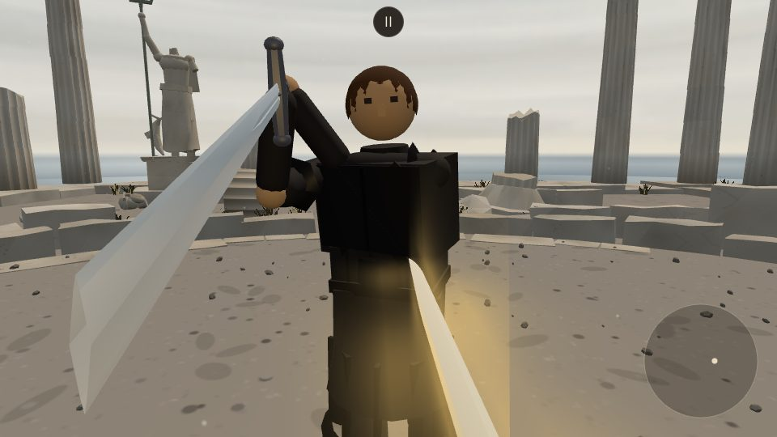
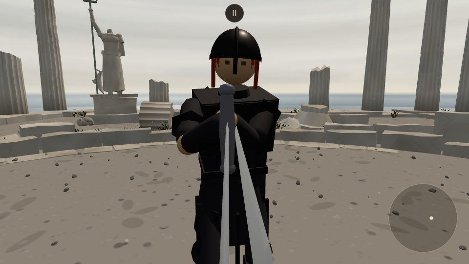
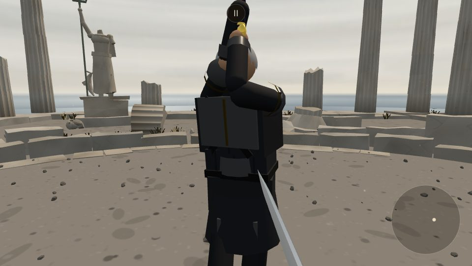
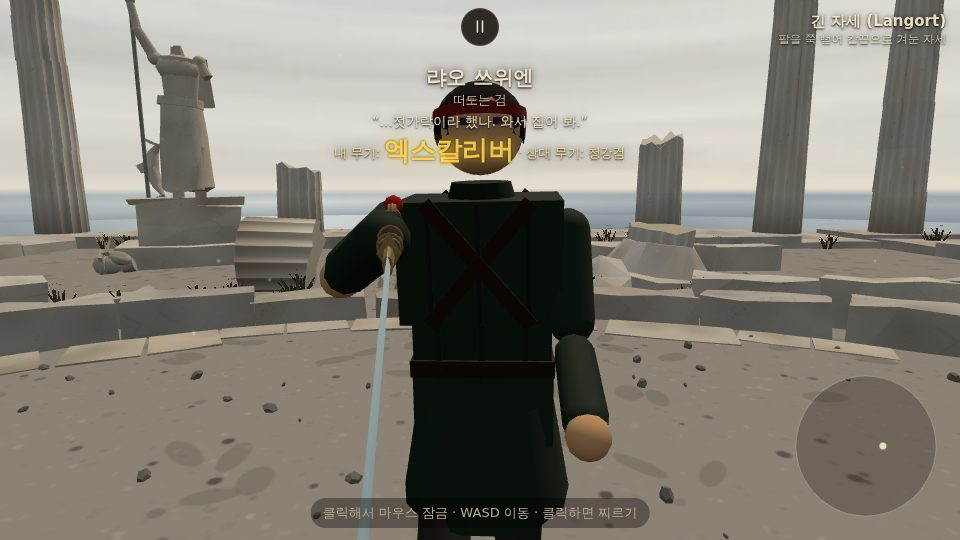
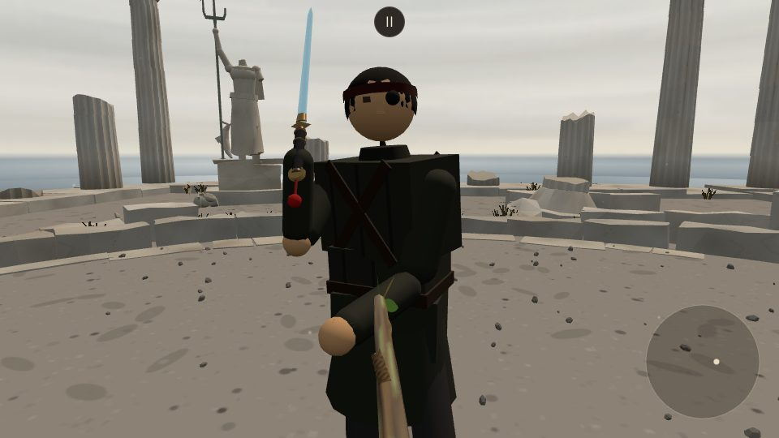
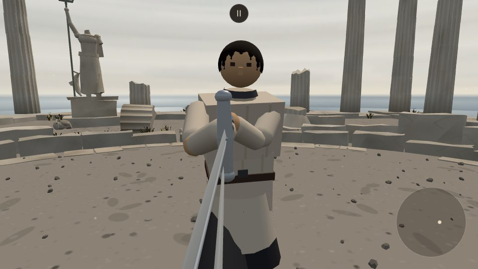
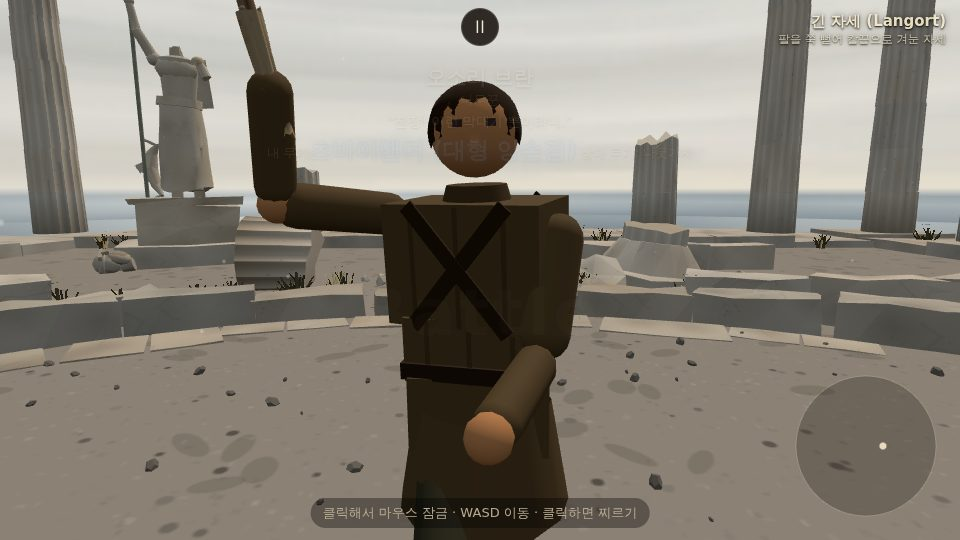
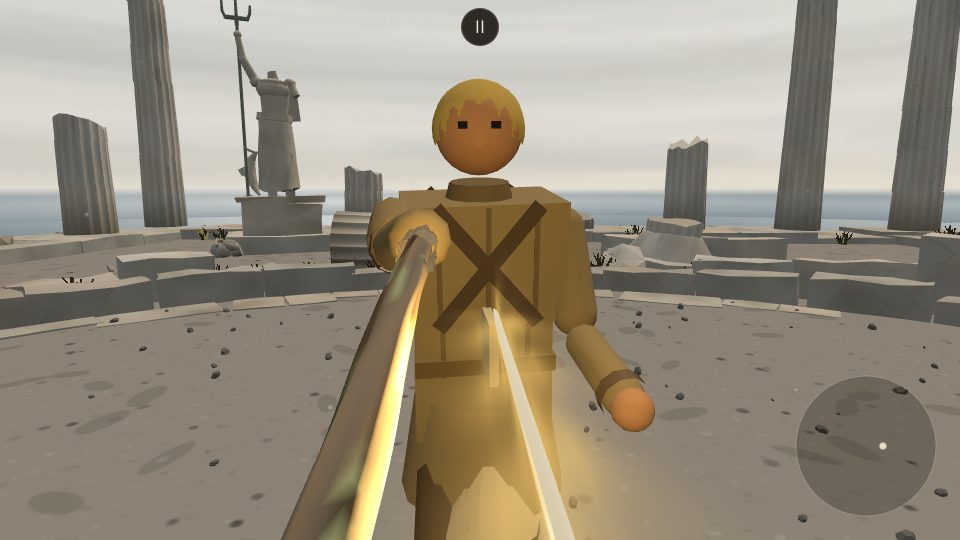

# 캐릭터 겉모습 (모델링 PM 라운드)

오너 요청: "캐릭터 모델링을 개선하고 싶다." 5인의 상대 캐릭터에 갑옷판·머리모양·수염·안대 같은
장식 레이어(`src/outfits.js`)를 새로 얹고, 예전 겉모습은 지우지 않고 `src/looks.js`의
`LOOK_ARCHIVE`에 `v0`로 남겨 두었다. 지금 게임이 쓰는 버전은 `CHARACTER_LOOK_VERSION`이
가리킨다(마르그레테만 `v2`, 나머지는 `v1`). 새 버전을 만들어도 옛 버전은 그대로 둔다.

플레이어(케틀햇+갬비슨)의 겉모습은 요청대로 건드리지 않았다.

**설정집 대조**: 디자인 전에 캐릭터 PM이 쓴 `docs/character_lore.md`·`docs/character_profiles.md`·
`docs/characters.md`(외모 문단)를 읽었다. 오너 요청과 설정집이 겹치지 않는 부분(브란의 낡은
가죽끈, 하인리히의 "화려한 배색", 마르그레테의 "수수하고 차분한 배색"·무장식 칼자루)은 반영했고,
색·실루엣이 정면으로 부딪히는 부분은 **오너 요청을 우선**하되 맨 아래 "설정집 대조" 절에 전부
정리해 캐릭터 PM이 설정집을 고칠 수 있게 했다.

## 파일 분담

캐릭터 PM(`claude/pm-characters`, AI·감정·대사 담당)과 `src/characters.js`를 같이 건드리므로,
그 파일에서는 캐릭터마다 `look:`/`lookVersion:` 두 줄만 바꿨다(다른 줄 재배열·재포맷 없음).
겉모습 데이터는 전부 `src/looks.js`(`LOOK_ARCHIVE`)와 새 파일 `src/outfits.js`에 있다.

## 미리보기

- `?look=<id>:<version>` — 그 캐릭터를 상대로 고정하고 그 버전을 입힌다. 예: `?look=margarethe:v0`
- `?lookv=<version>` — 이번에 고른 상대가 누구든 그 버전을 입힌다(`?foe=`와 함께 써도 된다)
- 버전 이름은 `v0`, `v1`처럼 `v` 접두사를 쓰거나 숫자만(`0`, `1`) 써도 된다

## 마르그레테 슈바르츠 (`margarethe`) — 용기사

**v0(예전)**: 회색 수수한 노장 — 회색 누비옷, 은발.
**v1(보관, `outfit: 'margarethe_dragon'`)**: 먹색(ink-black) 판금 가슴갑옷 + 낮고 두꺼운 쐐기꼴
견갑(용기사 실루엣, 뾰족한 장식이 아니라 방어판처럼), 갈색 머리. 골반의 기존 천 치마 위에 세로
판 10장을 두른 갑주 치마를 얹어 "아래는 치마"인 느낌을 살렸다. 문장·로고·특정 배우를 떠올릴
장식은 넣지 않았다(실루엣·분위기만 참고). **설정집 반영**: 처음엔 와인레드 트림을 넣었는데,
설정집이 그를 "수수하고 차분한 배색", "칼자루에 아무 장식이 없다"고 못 박아서 색 포인트를
빼고 같은 먹색 계열의 짙은/옅은 2톤(이음매만 도드라지게)으로 바꿨다 — 색이 아니라 만듦새로
"빈틈없음"을 낸다.
**v2(지금, `outfit: 'margarethe_dragon_helm'`)**: 오너 요청 "투구를 썼으면 좋겠어, 좀 더 붉은
머리로" — v1 갑옷 그대로에 투구를 씌우고 머리를 적갈색(`0x8a2e1a`)으로 바꿨다.
- 투구: 얼굴이 읽혀야 해서 얼굴을 막지 않는 **코가리개 투구**(nasal helm). 살짝 뾰족한 돔을 앞은
  들고 뒤는 내리게 기울여 이마 테가 눈 위에 걸리고 뒤통수·목덜미(목가리개)를 덮는다. 볏이나
  문장 없이 정수리에 낮은 능선 하나(더 짙은 판)만 — v1의 절제를 그대로 잇는다.
- 붉은 머리: 투구에 대부분 가려지므로 **정면에서는 얼굴 양옆으로 늘어진 옆머리**, **뒤에서는
  목가리개 밑으로 단정하게 땋아 내린 머리 한 가닥**으로 보이게 했다(처음엔 흘러내린 뒷머리를
  뾰족한 판 모양으로 만들었는데 지느러미처럼 보여서 땋은 머리로 바꿨다).
- 순수 장식: `look.helmet`은 `null` 그대로라 `hasHelmet`(머리 방어)이 켜지지 않고, 케틀햇처럼
  세게 맞아 벗겨지지도 않는다. 아래 "오너가 정할 것" 1번 참고.

| v0 | v1 | v2 (지금) |
| --- | --- | --- |
|  |  |  |

v2 투구 근접: [정면](character_looks/margarethe_v2_head_front.jpg) ·
[뒤(땋은 머리)](character_looks/margarethe_v2_head_back.jpg)

v2 추가 컷: [3/4](character_looks/margarethe_threeq.jpg) · [옆](character_looks/margarethe_side.jpg) ·
[기본 대결 화면](character_looks/margarethe_default.jpg) · [쓰러짐](character_looks/margarethe_down.jpg)
(쓰러져도 투구·땋은 머리가 머리를 따라간다). v1은 `?look=margarethe:v1`로 언제든 다시 볼 수 있다.

## 하인리히 도른 (`heinrich`) — 은빛 중갑 기사

**v0(예전)**: 붉은 금장 흥행 검객 — 빨간 더블릿, 금발.
**v1(지금, `outfit: 'heinrich_knight'`)**: 은빛(bright silver) 판금 가슴갑옷·배갑옷·허벅지
자락(tasset)·정강이받이(그리브)·손목 보호대(가운틀릿 커프)·둥근 견갑, 은발 + 짧은 은수염.
투구는 얹지 않았다(오너 요청에 투구 언급 없음, `hasHelmet` 관련 절 참고). **설정집 반영**:
설정집은 그를 "화려한 배색"의 자칭 왕의 기사로 쓴다 — 은빛으로 바뀌어도 그 허영은 남겨야 해서,
갑옷을 실전 갑옷보다 훨씬 반들반들하게(금속성 0.85·거칠기 0.16) 닦고, 예전 금빛 복제
엑스칼리버·금장 취향을 잇는 가는 금띠를 가슴 이음매와 양쪽 견갑 테두리에 둘렀다.

| v0 | v1 |
| --- | --- |
|  |  |

추가 컷: [3/4](character_looks/heinrich_threeq.jpg) · [옆](character_looks/heinrich_side.jpg) ·
[기본 대결 화면](character_looks/heinrich_default.jpg) · [쓰러짐](character_looks/heinrich_down.jpg)

## 랴오 쓰위엔 (`liao`) — 방랑 낭인

**v0(예전)**: 짙은 초록 방랑 검객 — 검은 머리, 붉은 머리띠.
**v1(지금, `outfit: 'liao_ronin'`)**: 장발(뒤로 묶어 등까지 늘어뜨림) + 한쪽 눈 안대(작은 판 +
짧은 끈). 사무라이 쇼다운의 방랑 검객(무사시·하오마루 계열) 분위기만 참고했고, 특정 캐릭터의
디자인을 그대로 베끼지 않았다.

| v0 | v1 |
| --- | --- |
|  |  |

추가 컷: [3/4](character_looks/liao_threeq.jpg) · [옆](character_looks/liao_side.jpg) ·
[기본 대결 화면](character_looks/liao_default.jpg) · [쓰러짐](character_looks/liao_down.jpg)

## 이졸데 반 아커러 (`isolde`) — 평상복

**v0(예전)**: 보랏빛 견습생 복장 — 보라 상의, 보라 머리띠.
**v1(지금, `outfit: 'isolde_saber'`)**: 평범한 사복 — 크림색 블라우스, 어두운 남색 긴 치마,
검은 머리. Fate 세이버의 사복 분위기만 참고했다. 치마는 넓적다리(thighF·thighB) 각각에 따로
붙여서, 래그돌이 다리를 벌려도 다리가 서로 다른 부위임이 읽히게 했다("다리가 읽혀야 한다"는
지시 반영).

> **오너 첨언(설정 정정)**: 이졸데를 "가장 약한 캐릭터"라 부른 것은 `characters.js`의 스탯 중
> 힘(strength) 수치를 낮게 잡은 결과일 뿐이다(`docs/characters.md`의 "가장 약한 검객 설정"도
> 손목 한계 스탯 얘기다). 실제 결투 실력이나 캐릭터로서의 강인함이 약하다는 뜻이 아니고, 겉모습도
> 그렇게 약하거나 가냘프게 그릴 필요가 없다. 위 디자인은 애초에 "수수한 평상복을 입은 세이버"
> 컨셉이라 이 정정과 방향이 맞는다 — 얌전한 옷차림이지 여려 보이는 옷차림이 아니다.

| v0 | v1 |
| --- | --- |
|  |  |

추가 컷: [3/4](character_looks/isolde_threeq.jpg) · [옆](character_looks/isolde_side.jpg) ·
[기본 대결 화면](character_looks/isolde_default.jpg) · [쓰러짐](character_looks/isolde_down.jpg)

## 오소리 브란 (`bran`) — 화전민 농부

**v0(예전)**: 어두운 잡색 — 짙은 갈색 상의, 검은 머리.
**v1(지금, `outfit: 'bran_farmer'`)**: 베이지~갈색 홈스펀 옷, 금발. 앞치마(가슴받이+허리
자락), 끈으로 묶은 로프 벨트(허리끈 색을 로프색으로), 소매를 걷어붙인 자국(팔뚝에 두른 어두운
띠)을 더했다. **설정집 반영**: "흙빛 튜닉에 낡은 가죽끈"이라 적혀 있어, 튜닉을 베이지~갈색
안에서 좀 더 흙빛으로 낮추고, 한때 뺐던 가죽 가슴끈(X자)을 새것처럼 반짝이지 않는 낡은 색으로
되살렸다.

| v0 | v1 |
| --- | --- |
|  |  |

추가 컷: [3/4](character_looks/bran_threeq.jpg) · [옆](character_looks/bran_side.jpg) ·
[기본 대결 화면](character_looks/bran_default.jpg) · [쓰러짐](character_looks/bran_down.jpg)

## 그리기 비용 (적 캐릭터 하나 기준, 무기·아레나·데칼 제외하고 격리 측정)

기본 대결 화면 전체(`game.renderInfo()`)는 핏자국·발자국 데칼·상대가 든 무기(브란은 10% 확률로
다른 무기)가 매 판 달라져서 그대로 비교하면 잡음이 크다. 그래서 `game.enemy`의 몸·무기 메쉬만
따로 순회해 삼각형·메쉬 수를 쟀다(장식 레이어만의 순수 증가분).

| 캐릭터 | 장식 전(v0) 메쉬 | 장식 전 삼각형 | 장식 후(v1) 메쉬 | 장식 후 삼각형 | 늘어난 메쉬 | 늘어난 삼각형 |
| --- | ---: | ---: | ---: | ---: | ---: | ---: |
| bran | 50–58* | 6163–7140* | 63 | 7244 | +5 | +104 |
| isolde | 52 | 6782 | 51 | 6782 | −1 | 0 |
| liao | 53 | 6274 | 55 | 6486–6502 | +2 | +212–228 |
| heinrich | 58 | 6830 | 70 | 7386 | +12 | +556 |
| margarethe (v1) | 51 | 6746 | 58 | 6982 | +7 | +236 |
| margarethe (v2, 지금) | 51 | 6746 | 61 | 7826 | +10 | +1080 |

(브란·하인리히는 설정집 반영 수정(가죽끈 복원, 금띠 추가)으로 앞선 측정보다 메쉬/삼각형이 조금
늘었다 — 여전히 수백 개 이내. 마르그레테 v2는 투구(돔·테·목가리개·코가리개를 합친 메쉬 1개 +
능선 1개)와 머리(옆머리·땋은 머리 1개)로 머리에 메쉬 3개가 붙어 다섯 중 가장 무겁다 — 그래도
+1,080삼각형이고, 그중 절반쯤이 땋은 머리 구슬 5개라 모바일에서 무거우면 거기부터 줄이면 된다.)

\* 브란은 `weaponAlt`로 10% 확률로 다른 무기를 드는데, 그 무기 자체의 메쉬 수가 측정마다 살짝
달라진다(장식과 무관). 이졸데는 v0의 보라 머리띠·가죽 끈(4장) 값이 v1의 옷깃·허리 리본·치마
2장보다 메쉬가 조금 더 많아서, 장식이 늘었는데도 총 메쉬 수는 오히려 1개 줄었다 — 옷을 더
단순하게 바꾼 결과다.

모든 캐릭터에서 늘어난 삼각형은 수백 개 수준(장식 없는 기본 몸 6천~7천 개의 몇 %)이고,
드로우콜은 부위 하나에 재질 1~2개짜리 병합 메쉬(`mergeGeometries`)로만 늘었다. 텍스처는 전혀
쓰지 않았다(단색 `MeshStandardMaterial`만).

## 스크린샷

Playwright(`--use-gl=angle --use-angle=swiftshader`)로 캐릭터별 정면·3/4·옆·기본 대결 화면·
쓰러진 자세를 찍었다. `docs/character_looks/` 아래 JPEG(각 40~57KB, 150KB 미만)로 저장했다.
콘솔 에러는 다섯 캐릭터 모두 0건.

## 물리 확인

- `node tools/sim/live_battery.mjs`, `node tools/sim/fights12.mjs`: 변경 전과 바이트 단위로
  동일 — 무기 겉모습과 같은 방식(`isolatedVisual`)으로 장식 전용 난수를 격리해 전역
  `Math.random` 소비량이 0이기 때문.
- `node tools/sim/characters_eval.mjs both 2`: 변경 없음.
- 콜라이더·질량·관절·`hasHelmet`(머리 방어)은 전혀 건드리지 않았다. AI 캐릭터 중 누구도
  `look.helmet = 'kettle'`을 쓰지 않는다 — 갑옷·견갑은 전부 겉보기만이고 전투 판정에 영향이
  없다.

## 설정집 대조 — 캐릭터 PM에게 (오너 요청이 이겼지만 기록해 둔 차이)

디렉터 지시대로 오너의 새 요청이 설정집과 부딪히면 오너 요청을 그대로 반영했다. 아래는 설정집
(`character_lore.md`·`character_profiles.md`·`docs/characters.md`의 "외모"/"프로필" 문단)과
실제로 다르게 나온 부분이다 — 설정집 쪽 문장을 고칠지는 캐릭터 PM 몫.

- **브란**: 설정집은 "짙은 갈색 곱슬머리"인데 오너가 금발을 요청해서 금발로 했다. 튜닉·가죽끈은
  설정집("흙빛 튜닉·낡은 가죽끈")과 맞춰 되살렸다(위 참고).
- **이졸데**: 설정집은 "보라색 더블릿·자주 머리띠·짙은 갈색 머리"(브루게 길드 정복 그대로)인데,
  오너가 "평상복(세이버 사복 느낌)·검은 머리"를 요청해서 길드 색을 완전히 벗겼다. 서사상으로는
  "사범 몰래 이름을 올렸다"는 설정과 오히려 잘 맞을 수 있다(길드복이 아니라 사복으로 나왔다는
  뜻으로 읽을 수 있음) — 다만 길드 소속감을 드러내는 보라색·인장이 사라진 건 캐릭터 PM이 확인할
  부분.
- **랴오**: 설정집은 "왼쪽 눈썹에 오래된 흉터"로 **두 눈 다 멀쩡**한데, 오너가 "안대"를 요청해서
  한쪽 눈을 가리게 했다. 이건 단순 색상이 아니라 "한쪽 눈이 실제로 안 보이는가"까지 걸리는
  설정 문제라 특히 캐릭터 PM 확인이 필요하다 — 지금 전투 코드(`read`·조준 등)는 두 눈 다 보인다는
  전제라 안대를 설정에 넣더라도 능력치를 낮출 필요는 없어 보이지만, 서사 문장은 "흉터"에서
  "안대"로 고쳐야 앞뒤가 맞는다.
- **하인리히**: 설정집은 "붉은 튜닉·금빛 장식·금발"의 빨강+금 쇼맨인데, 오너가 은빛 중갑을
  요청했다. **디렉터가 이미 "은빛이라도 화려하고 반들반들하게"로 방향을 정해 줘서** 반들거림·금띠로
  절충했다(위 참고) — 그래도 주 색은 빨강→은색으로 바뀌었으니 설정집 "외모" 문단의 색 서술은
  캐릭터 PM이 고쳐야 한다. 나이·체구·성격 서술은 그대로 맞는다.
- **마르그레테**: 설정집은 "짙은 회색 옷·은발"인데, 오너가 "먹색 판금·갈색 머리"를 요청했다.
  재질(천→판금)·주색(회색→먹색)·머리색(은발→갈색)이 다 바뀌었지만, "수수하고 차분한 배색"·
  "칼자루에 장식 없음"이라는 **태도**는 장식 없는 무채색 2톤으로 지켰다(위 참고). 왼손 약지의
  낡은 반지(설정집)는 이번 라운드에서 만들지 않았다 — 저해상도 캐릭터라 크기상 거의 안 보일
  정도라 우선순위를 낮췄다, 필요하면 다음 라운드에 작은 디테일로 추가 가능.
  **v2 추가 차이**: 설정집은 "투구 없음"인데 오너가 투구를 요청해서 씌웠고(v2), 머리색도 설정집의
  은발 → v1 갈색 → v2 적갈색으로 바뀌었다. 설정집 "외모" 문단(투구 유무·머리색)을 고칠 곳.

## 오너가 정할 것

1. **투구·갑옷이 실제로 막아 줘야 하는지** (마르그레테 v2로 더 급해졌다): 지금은 전부 순수
   장식이다. 그래서 마르그레테가 강철 투구를 쓰고 있는데도 머리를 맞으면 투구가 없는 것처럼
   피가 나고 두개골 판정이 난다(플레이어의 케틀햇은 막아 주고 세게 맞으면 벗겨져 날아간다).
   막게 하려면 두 갈래가 있다 — (가) `look.helmet`을 켜서 플레이어 케틀햇과 같은 머리 방어·
   벗겨짐을 그대로 쓰기, (나) 겉모습만 두고 맞았을 때 쇳소리·불꽃만 내기. (가)는 가장 어려운
   상대를 더 어렵게 만드는 밸런스 변경이라 디렉터·캐릭터 PM과 같이 정해야 한다.
2. 색·실루엣이 마음에 드는지 — `?look=`으로 언제든 옛 버전과 나란히 비교해 볼 수 있다
   (예: `?look=margarethe:v1`은 투구 없는 갈색 머리 버전).
