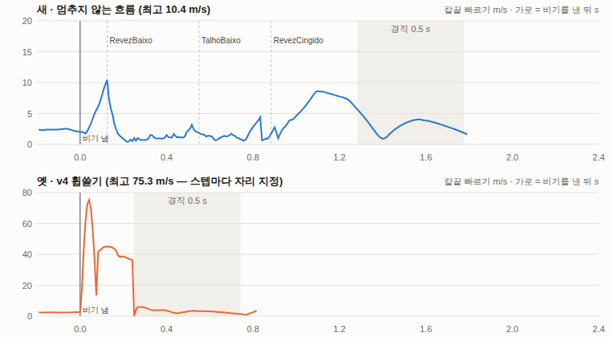
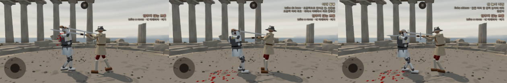

# 이베리아 비기 v5 — 멈추지 않는 흐름 (2026-10-11, 2 등급 작업자)

가지 `…/ib-secret-2q36ha` (origin/main 2d05769 에서). main 푸시 없음.

- 사장님 10/11 00:2x: "이베리아 비기 바꿔야 한다는 거 미리 알아둬. 인간 플레이어로서 흐름이 너무 끊기고 컨셉과 동작이 어색해. 유파 꾸러미에서 따로 노는 느낌.."
- 사장님 10/11 01:5x 승인: 디렉터 안 "1. 이베리아 비기를 몬탄테 흐름으로 다시 설계한다 2. 밸런스 단계에서 원전 근거로 번갈아 올려베기 비중을 높인다" → "그렇게 하자."
- 이 문서는 1 번이다. 2 번(가중치)은 손대지 않았다.

**한 줄**: v4 휩쓸기(정해진 자세로 감았다가 스텝마다 몸 자리를 정해 크게 한 번 — 칼끝 75 m/s 순간 뒤 멈춤)를 걷어 냈다. 대신 **지금 휘두르던 칼의 방향을 이어받아** 좌우 번갈아 아래에서 위로 올려베기 둘을 하고, 머리 위로 넘겨 **몸 가운데 높이를 둘러 베는 큰 한 칼**로 끝낸다. 모두 물리 서보 길이라 순간이동이 없다. 길은 이베리아 꾸러미에 이미 있는 것(talhoRevezBaixo · redondo · zwerch 줄 · 자세표 §16 원전 자리)만 썼다. 옛 판은 `?ibSecret=v4` 로 남겼다.

## 1. 컨셉 (세 줄)

1. 몬탄테가 호쾌한 까닭은 손목 힘이 아니라 **흐름**이다 — 벤 칼이 멈추지 않고 그 쪽으로 떨어져 감겼다가 거기서 다시 올라간다(피 복Ⅰ·복ⅩⅤ). 그리고 베기·걸음·머리 위 돌림이 한 박자다(고 규칙 4·5).
2. 비기는 새 동작이 아니라 **이베리아 기술을 끊김 없이 이어 붙인 것**이다. 첫 칼은 플레이어가 막 휘두른 방향을 그대로 잇는다.
3. 밀고 들어오는 상대를 멈추는 규칙이다(피 단Ⅶ·복Ⅶ). 그래서 조건은 v4 의 '호 안쪽'을 그대로 둔다.

## 2. 원전 근거

표기: [원문] 포르투갈어 · [원문 영역] Myers·Hick 영역(Wiktenauer, 이번에 다시 열어 확인) · [원문 독일어 역] 고디뉴 · [원전 2차] · [해석] · [추정].

| 자리 | 글 | 쓴 곳 |
|---|---|---|
| 피 복Ⅶ | 「in each step you must give a blow, always from low to high, alternating talho and revez, until the people stop」 [원문 영역] | 번갈아 올려베기 · 조건(밀고 드는 사람을 멈춤) |
| 피 단Ⅶ | 「This rule serves to deter people in a street and impede them moving from one end to another」 [원문 영역] | 조건 '호 안쪽' 유지의 근거 |
| 피 복Ⅰ | 「let fall the montante to the right to give an altibaxo … and from where the montante comes to a stop you will give a talho from low to high」 · 「let fall the montante to the left crossing the right arm over the left … a revez from low to high」 [원문 영역] | 떨어뜨림 토막 → 그 자리에서 올려베기 |
| 피 복ⅩⅤ | 올려 벤 칼이 「high in front of the head on the left side, in obtuse line」에 멈췄다가 그 쪽으로 altibaxo 하며 왼 어깨에 감음 [원문 영역] | 올려베기 끝 = 높이 비낌(황소 자리), 떨어뜨림은 같은 쪽 |
| 피 복Ⅱ | 「pass it over the head and behind the shoulders, such that it falls over the left arm to give a circling revez」 [원문 영역] | 머리 위로 넘김 → 그 쪽 옆에 떨어진 칼로 둘러 베기 |
| 피 단Ⅺ·복Ⅺ | 「talho orizontal」 · 「revez orizontal cingido」 [원문] | 큰 한 칼은 가로를 몸에 감아 둘러 벰 |
| 고 규칙 4·5 | 탈류가 「läuft durch bis er über deinem Kopf dreht」 · 「alles ein einziges Tempo」, 원을 따로 돌리면 「zwei Bewegungen」(규칙 4 주) [원문 독일어 역] | 감는 단계·멈춤을 두지 않음 |
| 고 규칙 9 | 「Tajos … in mittlerer Höhe zu einer der Seiten」 [원문 독일어 역] | 큰 한 칼의 높이 |
| 고 장 1 주 | 몬탄테는 무게 때문에 「wird es nicht stoppen」 [원문 독일어 역] | 맞힌 토막은 기다리지 않고 넘김 |

- 셋을 한 비기로 잇는 것, 첫 칼이 지금 칼의 방향을 잇는 것, 토막 문(§4)은 [해석]이다.
- 올려베기 둘(탈류·레베스 한 쌍)은 talhoRevezBaixo 와 같은 수다 [해석]. 손 자리 수는 모두 이미 있던 패드다.

## 3. 동작 차례

쪽 s = +1 오른쪽(탈류부터) · −1 왼쪽(레베스부터). 아래는 s = −1(끌기가 왼 아래 — 브라우저 확인 판)의 차례다. s = +1 이면 좌우가 거울이다.

| # | 토막 (코드 이름) | 패드 길 (모두 이미 있는 점) | 꾸러미 출처 | 문 (실제 칼끝이 여기 가야 다음) |
|---|---|---|---|---|
| ① | 왼쪽으로 떨어뜨림 (flowFallL) | 지금 손 → (옆 [−0.5, …]) → 왼 바꿈 [−0.40, −0.42] | talhoRevezBaixo 의 [−0.5, 0] 점 · §16 '떨어져 감긴 칼' | 칼끝이 왼쪽 · 가슴보다 아래 |
| ② | 올려 레베스 (flowRevezBaixo) | [−0.04, −0.08] → 황소 [0.22, 0.26] | unterhauL 길 · talhoRevezBaixo 둘째 반 | 칼끝이 오른쪽 · 가슴보다 위 |
| ③ | 오른쪽으로 떨어뜨림 (flowFallR) | [0.5, 0] → 바꿈 [0.38, −0.44] | talhoRevezBaixo 거울 | 칼끝이 오른쪽 · 가슴보다 아래 |
| ④ | 올려 탈류 (flowTalhoBaixo) | [0.04, −0.08] → 왼 황소 [−0.22, 0.26] | unterhau 길 · talhoRevezBaixo 첫 반 | 칼끝이 왼쪽 · 가슴보다 위 |
| ⑤ | 머리 위로 넘김 (flowOverL) | [−0.05, 0.5] → 왼 옆 자세 [−0.52, 0.06] | redondo 의 머리 위 점 · §16 옆 자세(몸에 감긴 가로 칼) | 칼끝이 왼쪽 · 가슴보다 뒤 |
| ⑥ | 둘러 베는 레베스 (flowRevezCingido) | [0.0, 0.1] → 옆 자세 [0.52, 0.06] | zwerchL 길 | — (따라 지나감 → 경직 0.5 s) |

첫 토막은 비기를 내는 순간의 손 움직임(dir)으로 정한다.
- 올려 베는 중(위로)이면 그 올려베기를 ② 꼴의 첫 수로 이어 끝까지 간다.
- 옆·아래로 가는 중이면 그 쪽으로 떨어뜨린다. 내려 베는 중이면 꺾지 않고 곧장 그 쪽 아래로 간다.
- 멈춰 있으면 손이 있는 쪽으로 떨어뜨린다. 가운데면 오른쪽이다(피 단Ⅰ 탈류부터).

토막 사이에 물레 점·준비 자세·붙잡기가 없다. 토막 끝마다 **문**이 있다(§4). 경직 0.5 s(사장님 결정 값)는 ⑥ 이 지나간 뒤에만 온다.

## 4. 왜 '문'이 필요했나 — 흐름 탐침

`node tools/sim/hybrid.mjs iberian_flow_probe.mjs zweihander 6`: AI 가 서 있는 롱소드 몸에게 비기를 직접 낸다. `WHO=player GAP=2.0` 은 플레이어 몸으로 낸다. 물리 스텝마다 칼끝 자리(몸 기준)·빠르기를 적는다.

| 판 | 흐름 길이 | 올려베기 칼끝 옆 폭 | 칼끝 최고 (토막 평균) | 토막 안 칼끝 바닥 |
|---|---|---|---|---|
| 처음 꼴 (손 목표만 따라 곧장 다음 토막) | 0.74 s | **0.23~0.26 m** — 좌우로 안 오감 | 9.5~11.8 m/s | 1.5~5.1 |
| + 문, 최대 0.5 s | 2.19 s | 0.5~1.2 m | 5~13 | **0~0.5** (막힌 토막에서 멎음) |
| + 문 최대 0.3 s · 맞히면 곧장 (공통 힘 1.3) | 1.86 s | 0.6~1.2 m | 8.6~13 | 2~5 |
| **기본: 위 + 이베리아 힘 창 1.6 · 보조 힘 1.5** | **1.73 s** | 0.6~1.5 m | **11~18** | **2~10** |
| 대조: 칼끼리 닿으면 곧장(넘김) | 1.29 s | 0.26 m (②) | 10~16 | 플레이어는 토막 0.1 s 로 뭉개짐·큰 칼 4.4 m/s → 뺌 |

- 무거운 칼은 손 목표(패드 16 m/s)를 못 따라온다. 그래서 곧장 다음 토막으로 가면 번갈아 베기가 한쪽에서 뭉개졌다(처음 꼴).
- 문은 실제 칼끝이 그 자리(쪽 · 가슴 위아래 · 앞뒤 — 문턱은 모두 0)에 갔는지 본다. 그때까지 손은 끝 자리를 당긴다.
- 최대 0.3 s 는 '따라 지나감'의 바탕 시간과 같은 값이다(ai.js follow timer 0.3 · skill.js follow 0.3). 0.5 면 막힌 토막에서 0.5 s 씩 서 흐름이 끊겨 보였다.
- 맞힌 토막은 문을 기다리지 않는다. 맞은 칼은 그 자리에 못 가지만 흐름은 멈추지 않는다(고 장 1 주).
- 힘 창 1.6·보조 힘 1.5 는 **새 값이 아니다**. 앞 이베리아 비기(10/9 휘돌려 사선 베기)의 `SECRET.iberianPower`·`iberianStrength` 를 그대로 쓴다. 공통 1.3 이면 아래에서 위로 올리는 토막이 높이 비낌까지 못 올라 문에서 멎었다.

AI 6 판, 토막마다 (기본):

| 토막 | 시간 | 칼끝 최고 | 바닥 | 칼끝 옆 폭 |
|---|---|---|---|---|
| 떨어뜨림 (왼) | 0.36 s | 15.8 m/s | 4.3 | 1.47 m |
| 올려 레베스 | 0.22 s | 11.4 | 2.3 | 0.63 |
| 떨어뜨림 (오른) | 0.26 s | 15.8 | 5.7 | 1.18 |
| 올려 탈류 | 0.37 s | 18.5 | 2.1 | 0.95 |
| 머리 위로 넘김 | 0.22 s | 17.3 | 10.3 | 1.56 |
| 둘러 베는 레베스 | 0.46 s | 13.3 | 2.1 | 1.47 |

- 처음엔 큰 한 칼을 어깨 뒤에서 사선(분노의 베기 줄)으로 냈다. 탐침에서 머리 위로 넘긴 칼이 어깨 뒤로 계속 내려가 사선이 나오지 않았다(칼끝이 뒤에 남아 2~3 m/s).
- 그래서 피 복Ⅱ 그대로 '어깨 뒤로 넘겨 그 쪽 옆에 떨어뜨리고 둘러 벰'(가로)으로 바꿨다. 가로는 이 물리에서 가장 센 길이다(§16-3 zwerch 245 J).

## 5. 조건

- **그대로: '호 안쪽'** (`when: 'inside'` — secret.js insideEvent).
  - 상대 가슴 거리 < 내 reach − `SECRET.iberianInside` 0.7, 그리고 다가오는 중(0.3 m/s 넘게)이거나 0.3 s 머묾.
  - 사장님 10/10 '0.7 그대로 둬'.
- 근거: 번갈아 올려베기 규칙 자체가 밀고 드는 사람을 멈추는 규칙이다(피 단Ⅶ·복Ⅶ). 흐름 컨셉과 맞는다.
- 지시서는 지금 조건을 '피해 없는 칼 닿음 셋'(v4, 10/10 01:2x)으로 적었다. 그러나 main 은 10/10 04:4x 부터 '호 안쪽'이다(school_secret 문서 §15-3). 맺힘 셋은 BindCount 로 자료만 남아 있다.
  - 맺힘 셋은 '막혀도 같은 길을 되풀이'의 셈이다. 흐름을 이어받는 비기와는 덜 맞는다. 그래서 고르지 않았다.
- 바꾼 것 하나: AI 는 **제 베기가 지나가는 중(follow)에도** 조건이 차면 비기를 낸다. 지나가던 칼을 이어받는 것이다.
  - 전엔 간 보기·물러남·막기·공격 준비에서만 냈다. 다른 유파는 그대로다.
  - 새 문턱·쿨다운은 없다.
- 발동 수 (48 판): 츠바이핸더 41 → 42 · 아이스 53 → 70. 판마다 0.9 · 1.5 번.

## 6. 플레이어 조작

- **창**: 그대로다(조건이 차면 0.5 s, 공격 입력 = 톡 또는 휘두르기만큼 빠른 끌기).
- **쥐는 것**:
  - ① 비기를 낸 그 끌기의 방향 = 첫 토막의 쪽(흐름 이어받기 — `main.js` 가 그 프레임의 끌기를 넘긴다). 톡이면 걸러진 손 목표 속도로 정한다.
  - ② 발(스틱)은 비기 동안 내 것이다. 피 복Ⅶ '걸음마다 한 칼'. 물러나며 이어도 된다 — 피 복Ⅰ '규칙을 풀며 물러남'.
- **맡기는 것**: 칼 길과 빠르기다. 여섯 토막을 비기가 낸다. 실행 동안 칼 입력은 무시한다(다른 비기와 같다).
- **끝**: 경직 0.5 s 동안 칼·발이 멈춘다(사장님 10/10 20:5x).

## 7. AI 쓰임

- AI 도 같은 함수(`secret.js montanteFlowSeq`·`flowGate`)를 쓴다. 토막마다 `flowInto` 로 잇는다. 연환삼격과 같은 틀이다.
- 첫 쪽은 AI 손 목표의 걸러진 속도(`skill.aimVel`)로 정한다.
- 반응 지연 0 · 정확도 1 · 손 속도 1.5 · 결정타 판정 1.3 은 다른 비기와 같다.
- 너무 붙으면(맞닿기 안) AI 는 베는 동안 이미 스틱을 뒤로 당긴다(ai.js moveFeet). 새 걸음은 넣지 않았다.

## 8. 측정 — 48 판 대 롱소드 (`node tools/sim/hybrid.mjs motion_lab.mjs duel <무기> 24 main`, 보고용)

전 = main 2d05769 (v4 휩쓸기) · 후 = 이 가지.

| | 츠바이핸더 전 | 츠바이핸더 후 | 북부 대공의 검(ice) 전 | ice 후 |
|---|---|---|---|---|
| 승/패/무 · 승률 (95 %) | 17/25/6 · 35 % (23~50) | 13/29/6 · **27 %** (17~41) | 13/31/4 · 27 % (17~41) | 12/29/7 · **25 %** (15~39) |
| 비기 낸 / 맞힘 | 41 / 35 | 42 / 20 | 53 / 34 | 70 / 30 |
| 비기 상처 J 평균 / 최대 (상처 수) | 95 / 100 (38) | 66 / 374 (69) | 91 / 96 (42) | 63 / 304 (103) |
| 넘어짐 모두 · **비기 동안·뒤 1 s** | 38 · **2** | 41 · **9** | 48 · **3** | 57 · **16** |
| 경직 든 수 (흐름 끝까지 간 수) | 36 | 24 | 43 | 40 |
| **맞은 상처** 경직 동안 · 비기 끝 뒤 1 s | 23 · 26 | 6 · **44** | 22 · 21 | 15 · **80** |
| 비기 토막마다 (motion_lab, 다음 토막까지) | 휩쓸기 0.25 s | 떨어뜨림 0.17~0.22 · 올려베기 0.28~0.31 · 넘김 0.27 · 둘러 벰+경직 0.68~0.76 s | 0.25 s | 0.17~0.32 · 0.28 · 0.69~0.81 s |

- 맞힌 토막 (츠바이핸더, 한 칼 최고 J 평균/최대 n): 올려 레베스 114/374 n10 · 떨어뜨림(왼) 75/153 n12 · 올려 탈류 69/163 n12 · 떨어뜨림(오른) 65/222 n6 · 넘김 60/180 n4 · **둘러 베는 큰 칼 17~24 J n4**.
- 대조 (같은 길, 공통 힘 1.3 — 이베리아 힘 창·보조 힘 없음, 츠바이핸더): 23 % · 낸 43 / 맞힘 26 · 비기 동안·뒤 1 s 넘어짐 6 · 상처 45 / 155 J.
- 읽기 [해석]:
  - 흐름이 1.5 s 안팎으로 길어졌다. 그동안과 뒤에 상대가 반격할 틈이 늘어 '끝 뒤 1 s 맞은 상처'가 늘었다(26 → 44 · 21 → 80).
  - 비기 동안·뒤 넘어짐도 늘었다(2 → 9 · 3 → 16). 피게이레두 맺음말의 경고('몸이 흔들리면 넘어진다') 그대로다. v4 는 0.25 s 동안 몸 자리를 정해 줘서 넘어지지 않았다.
  - 맞힘 비율은 85 % → 48 % 로 내렸다. v4 는 충돌을 끄고 스텝마다 칼을 그 자리에 놓았고, 흐름은 물리라 상대 칼에 막힌다.
  - **마지막 큰 칼이 결정타가 되지 못한다**(n 4 · 20 J 안팎). 붙은 거리에서 몸 가운데 높이 가로가 상대 칼·팔에 먼저 걸린다. 센 칼은 올려베기·떨어뜨림에서 나온다.
- 승률을 보고 값을 고르지 않았다.

## 9. 플레이어 흐름 확인 (브라우저, 콘솔 에러 0)

`tools/browser/iberian_flow_probe.mjs` (츠바이핸더 플레이어 · 상대 롱소드 AI 는 멈춤 · 닿는 거리 안쪽 1.9 m 까지 걸어 들어가 창을 열고 왼 아래로 끌기 한 번) → `tools/browser/iberian_flow_chart.mjs`.

- 새 판: 끌기(왼 아래) → 왼쪽으로 떨어뜨림부터 시작했다(흐름 이어받기 ✓).
  - 단계: 떨어뜨림 → 올려 레베스 → 떨어뜨림 → 올려 탈류 → 넘김 → 둘러 벰 → 따라 지나감 → 경직 → 조작.
  - 흐름 1.28 s. 칼끝 최고 10.4 m/s(첫 올려베기) · 8.6 m/s(큰 칼).
  - **가운데 0.15~0.85 s 는 1~3 m/s 로 낮다.** 멈춘 상대의 칼이 내 칼과 엇갈려 묶였다(세 순간 그림). 문이 0.3 s 씩 기다렸다가 넘겼다.
  - 같은 몸을 시뮬에서 상대 칼과 덜 겹치게(거리 2.0) 내면 토막마다 칼끝 최고 10.9~13.5 · 바닥 3.8~4.8 m/s 다(`WHO=player GAP=2.0`).
- 옛 v4: 0.25 s 동안 칼끝 최고 **75 m/s**(스텝마다 자리 지정 — 물리 밖)였다. 그동안 플레이어 손 패드는 움직이지 않았다([0.15, 0] 그대로). 경직이 시작되자 칼끝이 한 스텝에 6 → 0 m/s 로 멎었다.
- 세 순간 (옆에서, 왼쪽부터 올려 레베스 끝 · 올려 탈류 끝 · 둘러 베는 칼):

- 옛 v4 세 순간 (0.06 · 0.13 · 0.20 s): `docs/handoff/iberian_flow_strip_v4.png`.

## 10. 구현

| 파일 | 바꾼 것 |
|---|---|
| `src/schools.js` | `IBERIAN_SECRET` = 새 흐름(`do.flow` + 쓰는 패드 열쇠 — 모두 G 의 점 또는 이미 있는 길의 점) · 옛 칸은 `IBERIAN_SECRET_V4`(export) · `TRADITIONS.iberian.secret` 을 읽는 때 `SECRET.iberianSecret` 으로 고르는 getter(덮어쓰기 setter — motion_lab SECRET_DO_JSON). config 를 import(config 는 import 없음 — 고리 없음) |
| `src/secret.js` | `montanteFlowSeq`(토막 짓기) · `flowGate`(문) · `FLOW_GATE_MAX` 0.3 |
| `src/ai.js` | secretGo `D.flow` 가지 · secretStrikeEnd 문 · secretFree 에 follow(흐름 비기만) |
| `src/skill.js` | 플레이어 secret `D.flow` 가지 · 길 끝 문 · 토막 맞힘 `segHit` · 연환 고리 판정 `pre?.length`(빈 pre — 연환삼격은 pre 가 차 있어 그대로) |
| `src/main.js` | `?ibSecret=v4|flow` · 비기를 낸 끌기 방향(`o.dir`) |
| `src/config.js` | `SECRET.iberianSecret: 'flow'` (스위치 — 값 아님) |
| `test.html` · `src/test_pick.js` | 테스트 경로에 '이베리아 비기' 둘 고르기(새 · 옛) → 시작 주소에 `ibSecret=v4` |
| `tools/sim/iberian_flow_probe.mjs` · `tools/sim/iberian_flow_pads.mjs` | 흐름 탐침 · 패드 자리마다 칼끝과 문 점검 |
| `tools/browser/iberian_flow_probe.mjs` · `tools/browser/iberian_flow_chart.mjs` | 플레이어 칼끝 기록·세 순간 캡처 · 그래프·이어 붙이기 |
| `tools/sim/motion_lab.mjs` | 비기 토막마다 시간 줄이 흐름 비기도 셈 |

- 옛 판 견주기: 본판 `?ibSecret=v4` · 테스트 경로 test.html '이베리아 비기 → 옛' · 시뮬 `node tools/sim/with_config.mjs SECRET.iberianSecret=v4 hybrid.mjs motion_lab.mjs …`.
- 경직 0.5 s(`SECRET.stiff.iberian`)는 그대로다. v4 쪽 값(휩쓸기·카메라·밀어냄)도 그대로 남겼다.

## 11. 관문 (main 2d05769 대비)

| 관문 | 기대 | 결과 |
|---|---|---|
| fights12 ('deprecated parameters' 뺀 sha256 앞 8) | cc4e62b1 | cc4e62b1 ✓ |
| live_battery | e7ee3d96 | e7ee3d96 ✓ |
| finish_thrust 1 --stand | 433ac984 | 433ac984 ✓ |
| corr_s0 --limits=on,off --scenes=a,b | IDENTICAL 12/12 | 12/12 ✓ |
| weapon_smoke | OK 21/21 | 21/21 ✓ |
| npx vite build | 종료 0 | ✓ |
| name_policy | 위반 0 | 0 ✓ |
| 이베리아가 아닌 무기 duel 24 main (main 사본 대 이 가지) | 바이트 같음 | 다섯 모두 같음 ✓ (§11-1) |

### 11-1. 이베리아가 아닌 무기 duel

'deprecated parameters' 줄 뺀 출력의 sha256 앞 8, main 2d05769 사본(내려받은 트리) 대 이 가지, `cmp` 같음:

| 무기 (유파) | main | 이 가지 |
|---|---|---|
| 롱소드 (독일) | 86029ced | 86029ced ✓ |
| 모노호시자오 (일본) | 4304b1f5 | 4304b1f5 ✓ |
| 냉동 참치 (앞무게 무유파) | 9abf111a | 9abf111a ✓ |
| 레이피어 (이탈리아) | ca7ce481 | ca7ce481 ✓ |
| 청강검 (중국 — 연환삼격, skill.js `pre?.length` 를 지나는 판) | f0345a77 | f0345a77 ✓ |

## 12. 사장님께 여쭐 것

1. **흐름이 길어진 값**: 승률 35 → 27 % · 27 → 25 %. 비기 동안·뒤 넘어짐 2 → 9 · 3 → 16. 끝 뒤 1 s 맞은 상처 26 → 44 · 21 → 80. 물리로 잇는 흐름의 대가다. 밸런스 단계(디렉터 안 2 번)에서 볼지.
2. **마지막 큰 칼**: 지금은 둘러 베는 가로(피 복Ⅱ·고 규칙 9)인데, 붙은 거리에서 상대 칼에 걸려 결정타가 거의 안 된다(4 번 · 20 J 안팎). 센 칼은 올려베기에서 나온다. 고를 길:
   - (가) 그대로
   - (나) 사선(분노의 베기 줄) — 탐침에서 머리 위로 넘긴 칼이 어깨 뒤에 남아 안 나왔다
   - (다) 큰 칼 앞에 반걸음 물러남 — 피 복Ⅰ '물러나며 풂', 값은 v1 의 `iberianBack` −0.3 재사용
3. **올려베기 수 2** (탈류·레베스 한 쌍): 3 으로 늘릴지(흐름이 0.5 s 쯤 길어짐).
4. **플레이어 조작**: 지금은 첫 쪽(끌기 방향)과 발만 쥔다. 손가락을 계속 움직이는 동안 올려베기를 더 잇게 할지(흐름을 플레이어가 끊는 꼴) — 지금은 넣지 않았다.
5. **이베리아 힘 창 1.6 · 보조 힘 1.5** 재사용(§4 — 공통 1.3 이면 올려베기가 문에서 멎음). 확인표 862.
6. **AI 가 제 베기 follow 에서도 비기를 냄**(지나가던 칼을 이어받음 — 다른 유파는 그대로).

새 값·장치 = `docs/strike/owner_defaults_table.md` 860~866 (사장님 확인 전).
